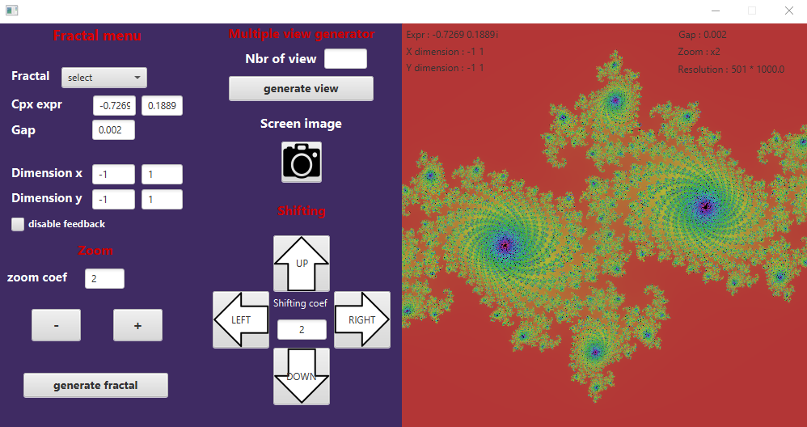

# Projet de CPOO5: Générateur de fractales

## Résultat, rendu graphique du projet

Voici une petite vidéo concaténant plusieurs images générée grâce à notre programme, donnant ainsi une petite idée du résultat :

https://youtu.be/0-2Azjd4g3U

---

## comment compiler le projet
*(depuis la racine)*

**Avec Gradle :**
* ``./gradlew build`` pour compiler
* ``./gradlew run`` pour executer le programme en interface graphique
* ``./gradlew run --args="<args>"`` pour exécuter le programme en mode console en spécifiant les arguments

**Liste des arguments**:
* `-g <value>`: pour définir le gap
* `-x0 <value>`: pour définir l'emplacement de la coordonnée x du coin inférieure gauche de l'ensemble de définition
* `-x1 <value>`: pour définir l'emplacement de la coordonnée x du coin supérieur droit de l'ensemble de définition
* `-y0 <value>`: pour définir l'emplacement de la coordonnée y du coin inférieure gauche de l'ensemble de définition
* `-y1 <value>`: pour définir l'emplacement de la coordonnée y du coin supérieur droit de l'ensemble de définition

---

## Utilisation de l'interface graphique

L'interface permet d'effectuer facilement plusieurs manipulations sur les fractales. Chaque fractale générée est visualisable sur la "preview" et sauvegardée à la bonne résolution dans un fichier de nom ``valeurRéel_valeurImaginaire.png``

### Notre interface se décompose en 5 parties

----

**1). Le menu dit principal :**
permet de définir les paramètres pour générer sa fractale
* l'expression complexe
* le pas (gap)
* les dimensions du plan

Afin de ne pas avoir à obligatoirement remplir tous les paramètres du menu, les champs sont initialisés au lancement. De plus, le menu déroulant **Fractal** permet de charger tous les champs avec la fractale sélectionnée.

Le bouton **generate fractal** permet finalement de générer la fractale à partir des valeur données plus haut.

Une checkbox **disable feedback** permet de masquer l'affichage sur la "preview".

**2). La partie zoom :** est là pour faire varier le niveau de zoom sur la fractale. Pour se faire, on joue sur les **dimensions** du plan et la valeur du **gap** par rapport au coefficient de zoom.

**3). Multiple view generator :** permet de créer le nombre spécifié de fractales avec, entre chaque image, la valeur de zoom donnée. Toutes les images sont sauvegardées au format **.png** dans un répertoire du nom de l'expression complexe de la fractale. 

Un bouton sous le label **Screen image** permet de sauvegarder dans un fichier la fractale affichée en "preview". L'intérêt est d'éviter que la fractale en preview soit perdue à la modification suivante. 

**4). Shifting :** permet de se déplacer grâce à des flêches directionnelles en fonction d'un coefficient incrémental modifiable.

**5). La preview :** affichant la dernière fractale générée avec ses valeurs.

---

## Considérations techniques

Quelques remarques justifiants l'implémentation de certaines fonctionalités.

### Interface graphique

Pour réaliser l'interface nous avons utilisés la librairie **javafx** couplée à du **fxml** et quelques lignes en **css** pour la gestion de texture des boutons.

Nous avons utilisé cette méthode afin de mieux gérer et gagner du temps sur la création de l'interface (placement des Hbox/VBox, textfiels, labels...). La manipulation des objets graphiques de javafx s'effectue ensuite de la même manière via une classe controleur, en l'occurence : ``FractController``.

Le fxml est semblable au xml mais intégre des balises adaptées à javafx. Au lancement de l'interface, dans ``ViewManager``, nous chargeons le fichier ``view.fxml`` qui sera interprété par javafx.

**Remarque :** il se peut qu'un avertissement soit levé au chargement de l'interface graphique. Cela n'a rien à voir avec notre programme **java** mais est du fait de la partie écrite en **fxml**. Au chargement des textures des flèches directionnelles, nous passons par une feuille de style au format **css**. Dans le code **css** certaines balises sont spécifiques pour le **fxml** et causent un avertissement qui ne perturbe en rien le bon fonctionnement du programme.  

### Création d'une fractale

Afin de générer une fractale de manière efficace, nous avons utilisé un système de **threads**. L'image à dessiner est décomposée en un nombre de parties égale au nombre de coeur du processeur. Chaque partie est écrite simultanément par son thread.

**Par exemple :** si le processeur contient 4 coeurs, le dessin de la fractale sera décomposé en 4 threads qui écriront en simultané. 

### Menu déroulant

Dans l'interface graphique, un menu déroulant permer de lister les différentes fractales disponibles à charger. Les paramètres de chaque fractale sont stockés dans la classe enum ``JuliaFractalList``.

---

### Datamodel

L'architecture du projet est la suivante:

La classe abstraite `Fractal` contient:
* un nombre complexe représentant la valeur c dans l'expression z^2+c utilisée pour le calcul de l'indice de divergence du complexe.
* un ensemble de définition, représentant la zone du plan sur laquelle le calcul sera effectué
* un gap représentant la valeur entre deux calculs de complexe

Chaque instance de la classe `Fractal` est initialisée à l'aide d'une instance de la classe `FractalBuilder` au moyen d'un **Pattern Builder**.

On donne ensuite l'instance initialisée de la classe `Fractale` à la classe `FractalDesigner` qui s'occupe de découper cette image plusieurs parties puis de lancer une instance de `FractalThread` avec chaque partie.

Ainsi, chaque partie de l'image est calculée séparément avant que cette image soit affichée ou enregistrée sur le disque.

Soutenance du projet en janvier 2022.
